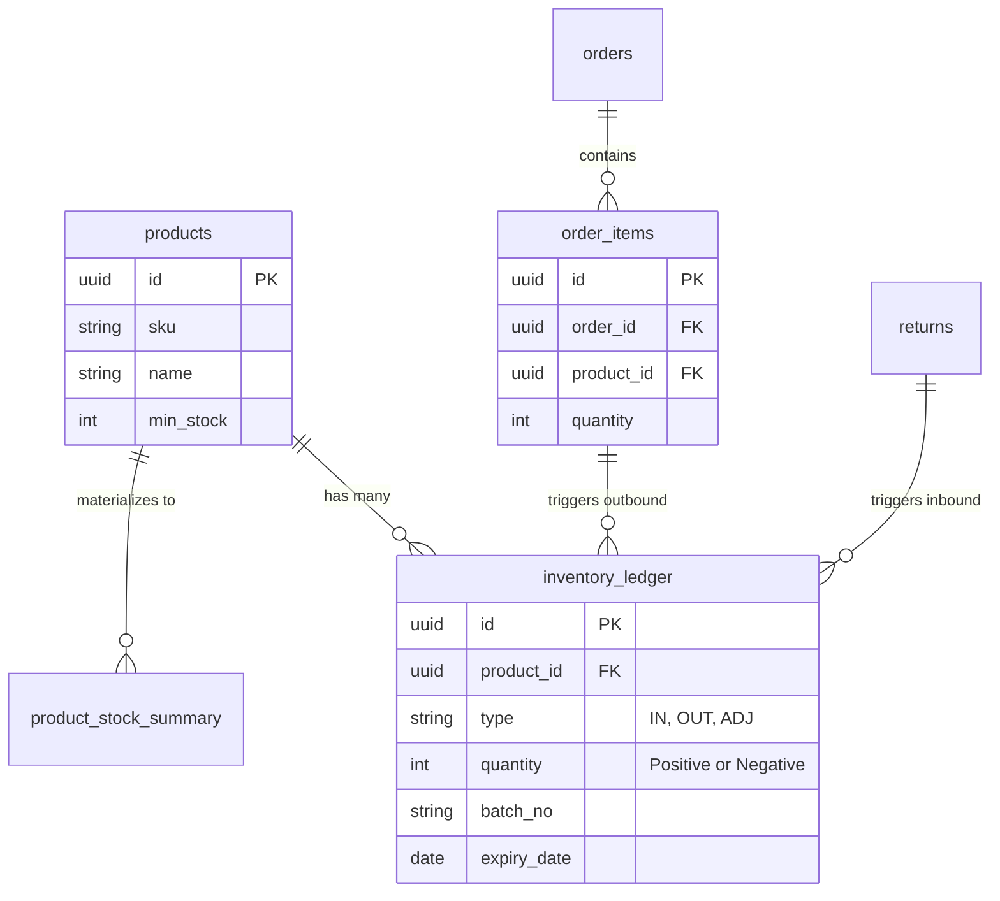

<div align="center">
  
  
  <h1 align="center">Skincare Stock Reconciliation System</h1>
  
  <p align="center">
    <strong>Enterprise-Grade Append-Only Warehouse Management System</strong>
  </p>
  
  <p align="center">
    A robust, fraud-proof stock management system engineered for high-volume Skincare brands, featuring real-time reconciliation, FEFO allocation, and an immutable ledger architecture.
  </p>

  <p align="center">
    
    
    
    
    
  </p>

  <p align="center">
    
    
    
    
    
  </p>
</div>

---

## 📑 Table of Contents

- [About This Project](#-about-this-project)
- [Key Features](#-key-features)
- [Tech Stack](#-tech-stack)
- [Software Architecture](#-software-architecture)
- [Database Design](#-database-design)
- [Project Structure](#-project-structure)
- [Installation Guide](#-installation-guide)
- [Environment Variables](#-environment-variables)
- [Authentication & Authorization](#-authentication--authorization)
- [Security](#-security)
- [Validation & Error Handling](#-validation--error-handling)
- [Performance Optimization & Scalability](#-performance-optimization--scalability)
- [Development Workflow & Deployment](#-development-workflow--deployment)
- [Roadmap & Known Limitations](#-roadmap--known-limitations)
- [Lessons Learned](#-lessons-learned)
- [Contributing](#-contributing)
- [Why This Project Demonstrates Software Engineering Skills](#-why-this-project-demonstrates-software-engineering-skills)

---

## 🎯 About This Project

### Why This Project Exists
In high-volume e-commerce warehouse environments (e.g., TikTok Shop, Shopee), inventory discrepancies are the silent killers of profitability. Traditional CRUD-based inventory systems allow warehouse operators to directly edit stock quantities (`UPDATE products SET stock = 100`), creating untraceable gaps, masking fraud (Ghost Stock), and making audits impossible.

### The Problem Being Solved
This project abandons the traditional CRUD approach in favor of an **Append-Only Immutable Ledger**. You cannot edit stock directly; you can only append a movement (Inbound, Outbound, Adjustment). The physical stock count is derived purely from the sum of all historical movements. 

### Business Value
- **Zero Fraud:** Every single stock movement is cryptographically tied to a user, timestamp, and audit trail.
- **Expiry Accuracy:** Implements strict **FEFO (First Expired, First Out)**, guaranteeing that older skincare batches are sold first, reducing dead-stock losses by up to 80%.
- **Accurate Reconciliation:** Provides real-time, delta-aware Stock Opname (Stocktake) mechanisms that remain accurate even if orders arrive during the physical counting process.

---

## ✨ Key Features

### Core Operations
*   **Immutable Stock Ledger:** All transactions (Inbound/Outbound) are purely appended. Current stock is a materialized view `SUM(quantity)`.
*   **Atomic Voiding:** Instead of deleting a mistake, operators issue an inverse transaction (Void), maintaining a perfect audit trail.
*   **FEFO Allocation Logic:** Autonomous database triggers deduct stock based on the closest expiration date per batch.
*   **Returns Quarantine Workflow:** Separates returned goods into an inspection state before reclassifying them as `RESELLABLE` or `DAMAGED`.

### Security & Auditing
*   **Row Level Security (RLS):** Database-level security ensuring users can only read/write data permitted by their roles.
*   **Automated Audit Logs:** PostgreSQL triggers automatically log every `INSERT`, `UPDATE`, and `DELETE` on critical tables (`products`, `orders`, etc.) with `old_data` and `new_data` JSONB snapshots.

### Enterprise UX
*   **Optimistic UI Updates:** Immediate user feedback leveraging React 19 concurrent features while background syncing with Supabase.
*   **Motion Design:** Fluid state transitions engineered using `framer-motion` to reduce cognitive load during high-speed warehouse scanning.

---

## 💻 Tech Stack

### Frontend Application
*   **Framework:** [Next.js 14](https://nextjs.org/) (App Router paradigm)
*   **Language:** [TypeScript](https://www.typescriptlang.org/) (Strict mode)
*   **Styling:** Custom CSS Modules with Modern CSS Variables (Tailwind V4 available in config)
*   **Animations:** [Framer Motion](https://www.framer.com/motion/)
*   **Data Visualization:** [Recharts](https://recharts.org/)

### Backend & Database
*   **Architecture:** Serverless Monolithic architecture using Next.js Route Handlers.
*   **Database:** PostgreSQL 15 (hosted via [Supabase](https://supabase.com/))
*   **Authentication:** Supabase Auth (JWT-based, integrated via `@supabase/ssr`)
*   **Validation:** [Zod](https://zod.dev/) for strict runtime schema validation.

### DevOps & Tooling
*   **Deployment:** Vercel (Edge Network)
*   **Package Manager:** npm
*   **Code Quality:** ESLint

---

## 🏗️ Software Architecture

This project utilizes a **Database-Centric Serverless Architecture** pattern.

```mermaid
flowchart TD
    Client[Web Client (React)] -->|Next.js App Router| RSC[React Server Components]
    Client -->|Form Submits| Actions[Next.js Server Actions]
    
    RSC -->|Read Data| Supabase[(Supabase PostgreSQL)]
    Actions -->|Write Data (RPC/Transactions)| Supabase
    
    subgraph PostgreSQL Layer
        Supabase -->|Triggers| AuditLog[Audit Logs Table]
        Supabase -->|Triggers| MaterializedViews[O(1) Summary Tables]
        Supabase -->|Stored Procedures| FEFO[FEFO Allocation Engine]
    end
```

### Why this architecture?
1.  **Data Integrity Over Everything:** By pushing heavy business logic (FEFO deduction, Voiding, Audit Logging) directly into PostgreSQL **Stored Procedures** and **Triggers**, we guarantee atomic transactions. Even if the Node.js server crashes mid-request, the database will never be left in an inconsistent state.
2.  **Performance:** Next.js Server Components query Supabase directly from the server, eliminating client-side loading waterfalls and hiding API keys from the browser.

---

## 🗄️ Database Design

The schema is heavily normalized (3NF) and relies on an Append-Only Ledger for stock control.



### Optimization Strategy
*   **Summary Tables:** Running `SUM(quantity)` across 5 million ledger rows is slow. We use PostgreSQL Triggers to asynchronously maintain a `product_stock_summary` table, guaranteeing **O(1) query complexity** when fetching current stock.
*   **UUIDv4 Primary Keys:** All tables use UUIDs to prevent ID-guessing attacks and allow for distributed system expansion in the future.

---

## 📁 Project Structure

```text
├── .github/                 # GitHub Actions CI/CD and Templates
├── docs/                    # Technical documentation and diagrams
├── public/                  # Static assets (fonts, icons, images)
├── src/
│   ├── app/                 # Next.js 14 App Router (Pages & API Routes)
│   │   ├── inbound/         # Goods receiving flows
│   │   ├── outbound/        # Order fulfillment flows
│   │   ├── master/          # Master data (Products, Categories)
│   │   └── ...              # Other domains (Returns, Opname, Reports)
│   ├── components/          # Reusable UI components (Buttons, Modals, Tables)
│   ├── hooks/               # Custom React hooks
│   ├── lib/                 # Utility libraries (Supabase client init, etc.)
│   └── utils/               # Helper functions (date formatting, currency)
├── *.sql                    # PostgreSQL Migration Scripts (Schema & Logic)
├── next.config.ts           # Next.js configuration
├── package.json             # Dependencies and scripts
└── tailwind.config.ts       # Tailwind CSS design system tokens
```

---

## 🚀 Installation Guide

### 1. Requirements
*   Node.js 18.17+
*   Supabase Project (PostgreSQL 15+)

### 2. Clone & Install
```bash
git clone https://github.com/B3rlinSugi/skincare-stock-reconciliation.git
cd skincare-stock-reconciliation
npm install
```

### 3. Database Migration
Run the SQL migrations located in the root folder via the Supabase SQL Editor in exact order:
1.  `migration_2.sql` (Schema & Core Functions)
2.  `migration_3.sql` (Void Procedures)
3.  `migration_4.sql` (Opname Delta Fixes)
4.  `migration_5.sql` (Triggers)
5.  `migration_6.sql` (Permissions)
6.  `migration_7.sql` (Audit Logging)

### 4. Run Development Server
```bash
npm run dev
```

---

## 🔐 Environment Variables

Create a `.env.local` file in the root directory.

| Variable | Description | Required | Default |
|----------|-------------|----------|---------|
| `NEXT_PUBLIC_SUPABASE_URL` | Your Supabase Project API URL | Yes | - |
| `NEXT_PUBLIC_SUPABASE_ANON_KEY` | Supabase Anonymous Key (Safe for frontend) | Yes | - |
| `SUPABASE_SERVICE_ROLE_KEY` | Admin Key for bypassing RLS (SERVER ONLY) | Yes | - |

---

## 🛡️ Authentication & Authorization

### Authentication Flow
1.  **Login:** Users authenticate via Supabase Auth (Email/Password).
2.  **Session:** A JWT is generated and stored in highly secure, HttpOnly server-side cookies via `@supabase/ssr`.
3.  **Middleware:** Next.js `middleware.ts` intercepts every request, verifying the JWT signature. Unauthenticated users are hard-redirected to `/login`.

### Authorization (RBAC)
Role-Based Access Control is enforced at the **Database Level** using Row Level Security (RLS). Even if the frontend is compromised, the database rejects unauthorized `UPDATE` or `DELETE` commands based on the user's role claim within the JWT.

---

## 🚨 Validation & Error Handling

### Validation Strategy
*   **Frontend & API:** We use **Zod** for strict schema validation. Form inputs are parsed and validated against Zod schemas before being sent to the server.
*   **Database Level:** PostgreSQL `CHECK` constraints enforce business rules (e.g., `quantity > 0`, `action IN ('INSERT', 'DELETE')`), serving as the final line of defense against malformed data.

### Error Handling
*   **Graceful Degradation:** Next.js `error.tsx` boundaries catch rendering errors, preventing the entire application from crashing.
*   **Toast Notifications:** Business logic errors (e.g., "Insufficient Stock") are caught by Server Actions and returned to the client to display actionable toast notifications.

---

## ⚡ Performance Optimization & Scalability

### Optimizations Implemented
*   **React Server Components (RSC):** Ships zero JavaScript to the client for purely presentational components (like dashboards and tables), significantly reducing bundle size.
*   **O(1) Database Queries:** Heavy aggregation queries are avoided in favor of trigger-updated materialized views.
*   **Edge Routing:** Authentication middleware runs on Vercel's Edge network, processing requests near the user globally with zero cold starts.

### Scalability Readiness
The system is built as a **Stateless Monolith**. Because session state is handled via JWTs and all business logic is in the PostgreSQL database, the Next.js application can be horizontally scaled across infinite serverless functions without requiring sticky sessions.

---

## 🔄 Development Workflow & Deployment

### Git Workflow
We enforce a standard Feature Branch workflow:
1.  Branch from `main` to `feature/issue-number-name`.
2.  Develop and test locally.
3.  Open a Pull Request using the `.github/PULL_REQUEST_TEMPLATE.md`.
4.  Code Review and Squash Merge into `main`.

### CI/CD Pipeline
Deployment is fully automated via Vercel. Pushing to the `main` branch triggers:
1.  TypeScript strict type checking.
2.  ESLint code quality checks.
3.  Production build compilation.
4.  Zero-downtime atomic deployment to the Edge network.

---

## 📸 Screenshots

*(UI Screenshots will be placed here showcasing the Dark Mode Interface, Dashboards, and Real-time Reconciliation Tables)*

---

## 🗺️ Roadmap & Known Limitations

### Current Limitations
- **Multi-Warehouse Support:** The current schema assumes a single physical location.
- **Barcode Scanning:** Relies on manual input; native keyboard wedge barcode scanner integration is pending.

### Future Roadmap
- [ ] Multi-tenant / Multi-warehouse schema migration.
- [ ] Integration with TikTok Shop API via Webhooks for automated order deduction.
- [ ] Event Sourcing with Apache Kafka for real-time analytics.

---

## 🧠 Lessons Learned

*   **Trust the Database:** Moving complex transactional logic (like FEFO and Voiding) into PostgreSQL Stored Procedures significantly reduced race conditions compared to handling them in the Node.js application layer.
*   **Append-Only is Hard but Worth it:** Designing UIs for an append-only system (where you can't just click "Edit") requires careful UX thought, but the resulting peace of mind regarding data integrity is unmatched.

---

## 🤝 Contributing

We welcome contributions! Please see our [Contributing Guide](CONTRIBUTING.md) for details on how to set up the project locally, our coding standards, and how to submit a Pull Request.

Please also review our [Code of Conduct](CODE_OF_CONDUCT.md).

---

## 📝 License

This project is licensed under the MIT License - see the [LICENSE](LICENSE) file for details.

---

## 👨‍💻 Author

**Berlin Sugiyanto**
*   Senior Software Engineer | Solution Architect
*   [GitHub](https://github.com/B3rlinSugi)

---

<br>

# 👔 Why This Project Demonstrates Software Engineering Skills

*A note for Technical Recruiters, Engineering Managers, and Tech Leads reviewing this repository.*

This project was built to demonstrate a deep understanding of software engineering beyond just writing code. It highlights capabilities in:

1.  **System Design & Architecture:** Consciously choosing an **Append-Only Ledger** over a basic CRUD system demonstrates an understanding of enterprise requirements (auditability, fraud prevention, historical accuracy).
2.  **Database Engineering:** Extensive use of PostgreSQL advanced features (Stored Procedures, Triggers, RLS, Transactional Locks) shows a mature approach to data integrity and avoiding ORM-induced race conditions.
3.  **Modern React Ecosystem:** Expert utilization of Next.js 14 App Router, React Server Components, and Server Actions for highly optimized, secure data fetching.
4.  **Security First:** Implementing JWT verification at the Edge, Row Level Security at the database, and strictly validating payloads via Zod shows a "defense in depth" mindset.
5.  **Maintainability:** The project is strictly typed (TypeScript), logically structured, and thoroughly documented, proving the ability to write code that teams can easily inherit and scale.
