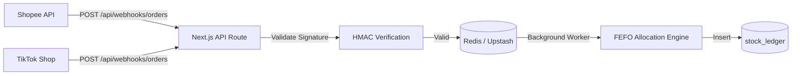

# Future Webhook & API Integration Design

To reach Level 5 Autonomy (Enterprise ERP), the system must eventually integrate directly with E-Commerce platforms (Shopee Open Platform, TikTok Shop Partner API).

## 1. Webhook Ingestion Architecture

Currently, the system assumes human operators input the `OUTBOUND` quantities. In the future, this will be replaced by a Webhook Receiver.



## 2. API Endpoint Structure

### `POST /api/webhooks/marketplace`
Receives order creation and cancellation events.

**Payload Example:**
```json
{
  "marketplace": "SHOPEE",
  "order_id": "230910ABCDEFGH",
  "status": "READY_TO_SHIP",
  "items": [
    {
      "sku": "AURA-HYDRO-50",
      "quantity": 2
    }
  ]
}
```

**System Action:**
1. Verifies HMAC signature using the Marketplace Secret Key.
2. Identifies internal `product_id` via the provided `sku`.
3. Runs the FEFO allocation engine.
4. Appends a new `OUTBOUND` row to `stock_ledger` with `channel = 'SHOPEE'`.

## 3. Idempotency

Network retries from Shopee/TikTok are common. The system must guarantee Idempotency.
- **Rule:** The `reference_id` column in `stock_ledger` combined with `movement_type` must have a unique constraint, preventing double-deduction if Shopee fires the webhook twice for the same `order_id`.
