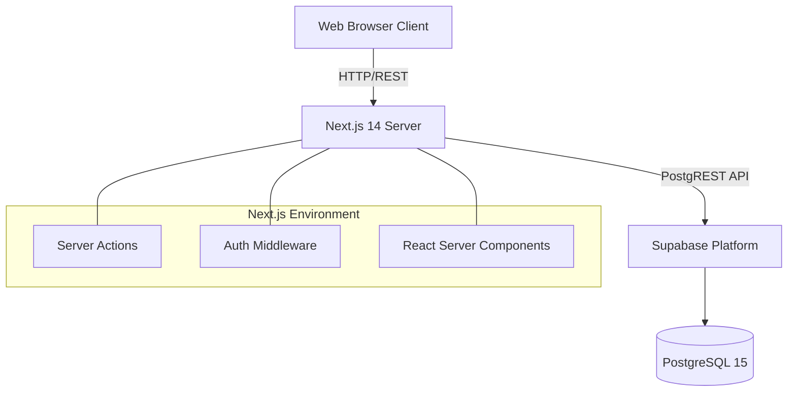
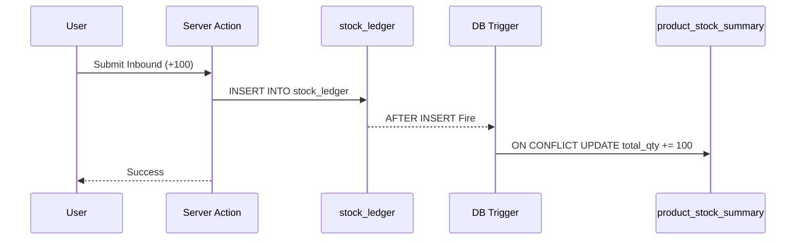

# System Architecture & Data Flow

This document outlines the architectural decisions and data flow of the Skincare Stock Reconciliation System.

## 1. High-Level Architecture

The system follows a Serverless Monolithic architecture built on Next.js 14 App Router, heavily relying on PostgreSQL (Supabase) for business logic enforcement.



## 2. Core Paradigm: Append-Only Ledger

Traditional inventory systems use CRUD (Create, Read, Update, Delete) where `UPDATE products SET stock = stock - 1` is common. This leads to untraceable data leaks.

We implemented an **Append-Only Ledger**. The `stock_ledger` table is the single source of truth. 
- You cannot `UPDATE` a row in the ledger.
- You cannot `DELETE` a row in the ledger.
- If a mistake is made, a compensating transaction (Void) is appended.

### The Flow of Stock Calculation
Stock is never stored natively as an editable integer. It is a strictly derived materialized value.

```sql
-- Conceptual Flow
Current_Stock = SUM(quantity) FROM stock_ledger WHERE product_id = X;
```

## 3. Performance Optimization (O(1) Summary Tables)

Computing `SUM()` across millions of ledger rows on every dashboard load would cause a bottleneck. To solve this, we implemented Database Triggers (in `migration_5.sql`) that update `product_stock_summary` asynchronously.



## 4. Concurrency Management

When physical Stock Opname (stocktake) occurs, it is highly susceptible to race conditions. If an operator counts 50 items on the shelf, but a web order subtracts 1 item during the counting process, simply updating the stock to 50 will cause a mismatch.

**Solution:** The system calculates the delta based on a snapshot of the ledger at the exact millisecond the counting started, resolving discrepancies atomically.
